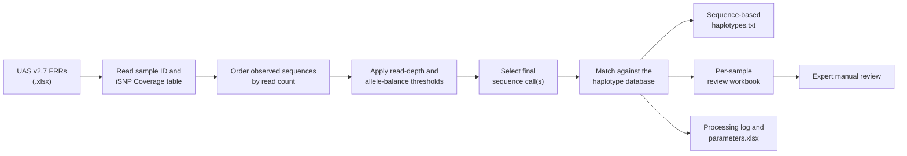
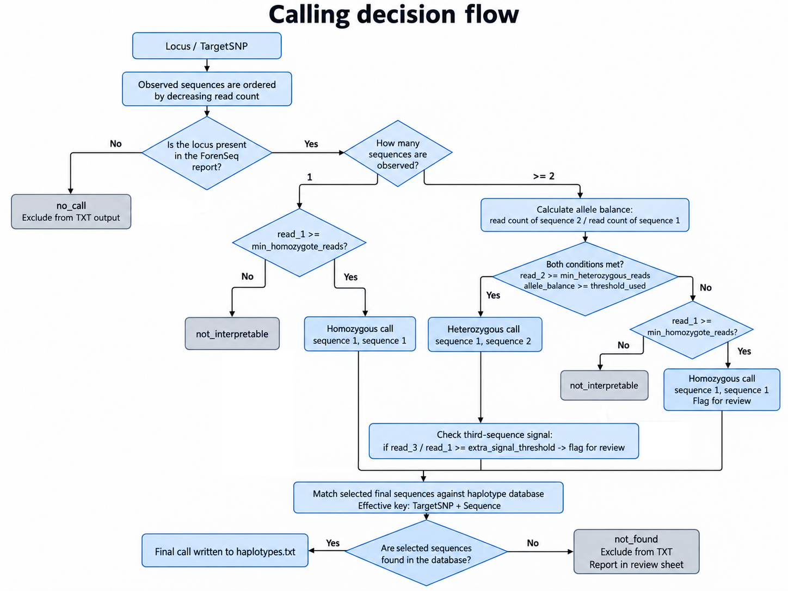

<!-- README.md is generated from README.Rmd. Please edit README.Rmd, not README.md. -->

<div align="center">

# 🧬 forenseqhaplo

### Sequence-based haplotype characterization from ForenSeq iiSNP Flanking Region Reports

**ForenSeq UAS v2.7 reports → sequence selection → haplotype assignment
→ Familias.txt**

<br>

<!-- badges: start -->

[](https://github.com/FISABIO-BioinformaticsService/forenseqhaplo/actions/workflows/R-CMD-check.yaml)


[](LICENSE.md)


<!-- badges: end -->

<br>

[Overview](#1-overview) · [Workflow](#2-workflow) ·
[Installation](#3-installation) · [Quick start](#4-quick-start) ·
[Functions](#5-main-functions) · [Help](#15-help-and-function-reference)
· [Citation](#16-citation)

</div>

------------------------------------------------------------------------

## 1. Overview

`forenseqhaplo` is an R package for the automated processing of
**ForenSeq™ Flanking Region Reports (FRRs)** and the generation of
**Familias** input files.

The package is designed for sequence-based analysis of ForenSeq iiSNP
amplicons. It reads one or multiple FRRs generated by UAS v2.7, extracts
and filters sequence information according to user-defined coverage and
allele balance thresholds, assigns sequence-based haplotypes using a
reference database, and generates reviewable outputs for manual
inspection.

<table>

<tr>

<td align="center" width="25%">

<strong>📥 Input</strong><br> ForenSeq UAS (<code>.xlsx</code>) reports
</td>

<td align="center" width="25%">

<strong>⚙️ Interpretation</strong><br> Read depth and allele-balance
thresholds
</td>

<td align="center" width="25%">

<strong>🧬 Assignment</strong><br> Sequence-based haplotype matching
</td>

<td align="center" width="25%">

<strong>📤 Output</strong><br> Familias (<code>.txt</code>), review
Excel and logs
</td>

</tr>

</table>

### Key capabilities

- Process individual samples or complete folders of FRRs.
- Apply user-defined global and locus-specific filtering thresholds.
- Use the bundled haplotype database or a custom reference database.
- Generate reviewable Excel reports for quality control and manual
  inspection.
- Generate Familias and DVI-Familias input files.
- Optional export of target SNP genotype files.
- Combine replicate reports into a composite genetic profile.
- Include population-frequency resources for Familias analyses.

> \[NOTE\] `forenseqhaplo` is a data-processing and review-support tool.
> It does **not** replace laboratory validation or expert
> interpretation. Users are responsible for validating analysis
> parameters, reviewing flagged loci, and approving final genotype and
> haplotype calls.

## 2. Workflow



### Main outputs

| Output | Description |
|:---|:---|
| `haplotypes.txt` | Sequence-based haplotype genotypes (one row per sample) formatted for the ‘Case-related DNA Data’ section in Familias |
| `review_<sample_id>.xlsx` | Final calls, review cases, and all observed sequences |
| `processing_log.tsv` | Processing status and summary statistics for folder analyses |
| `parameters.xlsx` | Processing parameters used in the run |
| `target.txt` | Target SNP genotypes (one row per sample) formatted for the ‘Case-related DNA Data’ section in Familias |

You can find a more detailed explanation of the output files in Section
9.

## 3. Installation

### Install from GitHub

After the repository is available on GitHub, install the package with:

``` r
install.packages("remotes")

remotes::install_github(
  "FISABIO-BioinformaticsService/forenseqhaplo",
  dependencies = TRUE,
  upgrade = "never"
)
```

Install a tagged release, for example `v1.0.0`:

``` r
remotes::install_github(
  "FISABIO-BioinformaticsService/forenseqhaplo",
  ref = "v1.0.0",
  dependencies = TRUE,
  upgrade = "never"
)
```

### Install from a downloaded GitHub ZIP archive

If you download the repository from GitHub using **Code → Download
ZIP**, GitHub will generate a file such as:

``` text
forenseqhaplo-main.zip
```

or, when downloading a tagged release:

``` text
forenseqhaplo-1.0.0.zip
```

Install it directly from R with:

``` r
install.packages("remotes")

remotes::install_local(
  "path/to/forenseqhaplo-main.zip",
  dependencies = TRUE,
  upgrade = "never"
)
```

You can also unzip the file and install from the extracted folder:

``` r
install.packages("remotes")

remotes::install_local(
  "path/to/forenseqhaplo-main",
  dependencies = TRUE,
  upgrade = "never"
)
```

## 4. Quick start

Process all valid ForenSeq reports in a folder:

``` r
library(forenseqhaplo)

result <- process_forenseq_folder(
  input_dir = "path/to/forenseq_reports",
  output_dir = "path/to/results"
)
```

This creates a folder like:

``` text
results/
├── haplotypes.txt
├── parameters.xlsx
├── processing_log.tsv
├── review_sample_1.xlsx
├── review_sample_2.xlsx
└── ...
```

The returned object contains the main processed tables and output paths:

``` r
result$familias_txt
result$processing_log
result$processing_parameters
result$output_txt
result$output_parameters_xlsx
```

## 5. Main functions

| Function | Purpose |
|----|----|
| `process_forenseq_folder()` | Process all ForenSeq reports in a folder and create combined outputs |
| `process_forenseq_sample()` | Process a single ForenSeq report |
| `combine_reports()` | Combine replicate review Excel files into a composite genetic profile TXT |
| `load_haplotype_database()` | Load the bundled haplotype database |
| `export_haplotype_database()` | Export the bundled haplotype database to Excel |
| `validate_haplotype_database()` | Validate a bundled or custom haplotype database |
| `default_*()` functions | Inspect default loci, thresholds, and review parameters |

------------------------------------------------------------------------

## 6. Input data and requeriments

### ForenSeq reports

The default input is the `iSNP Coverage` sheet from a ForenSeq Flanking
Region Report.

The package expects:

| Information | Accepted column names |
|----|----|
| Locus | `iSNP Locus`, `iSNP & Variant Reference SNP`, or `iSNP and Variant Reference SNP` |
| Detected base | `Detected Bases` or `Detected Base` |
| Read count | `Read`, `Reads`, or `Read Count` |
| Sequence | `Sequence` |

The sample identifier is read from cell `B5`. If the sample identifier
is missing during folder processing, the input filename is used as
fallback.

### Input folder behaviour

`process_forenseq_folder()` processes `.xlsx` files in `input_dir` and
ignores files that are likely to be previous outputs or temporary files,
including:

- Excel temporary files beginning with `~$`.
- Per-sample review files.
- `parameters.xlsx`.
- `processing_log.tsv`.
- Haplotype and target TXT files.

## 7. Calling algorithm

The algorithm is sequence-based. `Detected Bases` is retained for
traceability, but the final call is based on the observed `Sequence`
values.

For each expected `Target SNP`:

1.  Observed sequences are ordered by decreasing read count.

2.  If the locus is absent from the ForenSeq report, it is reported as
    `no_call` and excluded from the TXT output.

3.  If only one sequence is observed and its read count is at least
    `min_homozygote_reads`, the sequence is duplicated as a homozygous
    call.

4.  If two or more sequences are observed, the allele balance is
    calculated as:

    ``` text
    read count of sequence 2 / read count of sequence 1
    ```

5.  The two most abundant sequences are accepted as a heterozygous call
    when both conditions are met:

    ``` text
    read_2 >= min_heterozygous_reads
    allele_balance >= threshold_used
    ```

6.  If the allele balance is below the threshold but the primary
    sequence has enough reads, the primary sequence is duplicated as a
    homozygous call and the locus is flagged for review.

7.  Calls with insufficient read support (min_homozygote_reads) are
    marked as `not_interpretable`.

8.  A relevant third sequence is flagged for review when its
    third-to-first read ratio reaches `extra_signal_threshold`.

9.  Selected final sequences are matched against the haplotype database
    using the effective key `TargetSNP + Sequence`.

10. If one or both selected sequences are not found in the database, the
    locus is marked as `not_found`, excluded from the TXT, and reported
    in the review sheet.

All threshold comparisons are inclusive. A value exactly equal to its
threshold is accepted.

### Calling decision flow

The following diagram summarizes the decision logic used by
`forenseqhaplo` to classify each locus, decide whether it can be
exported to `haplotypes.txt`, and flag cases that require manual review.



## 8. Thresholds and review parameters

### Default interpretation parameters

| Parameter | Default | Meaning |
|----|:--:|----|
| `heterozygote_threshold` | 0.30 | General minimum allele balance required to accept the second sequence |
| `min_homozygote_reads` | 30 | Minimum reads required to duplicate a single sequence as a homozygous call |
| `min_heterozygous_reads` | 11 | Minimum reads required for the second sequence in a heterozygous call |
| `extra_signal_threshold` | 0.25 | Minimum third-to-first ratio used to flag relevant extra signal |
| `review_balance_lower_margin` | 0.15 | Lower proportional margin (LPM) used to flag calls close to the allele-balance threshold.<br><span style="display: block; text-align: center; white-space: nowrap;">heterozygote_threshold \* (1 - LPM)</span> |
| `review_balance_upper_margin` | 0.15 | Upper proportional margin (UPM) used to flag calls close to the allele-balance threshold.<br><span style="display: block; text-align: center; white-space: nowrap;">heterozygote_threshold \* (1 + UPM)</span> |
| `review_low_homozygote_multiplier` | 1.50 | Accepted homozygous calls below `min_homozygote_reads * review_low_homozygote_multiplier` are flagged for review. |

Some loci use lower default allele-balance thresholds:

| Threshold | Loci                                  |
|:---------:|---------------------------------------|
|   0.10    | `rs729172`, `rs10776839`, `rs1335873` |
|   0.20    | `rs338882`, `rs1493232`, `rs6955448`  |

All other loci use the general `heterozygote_threshold`.

Inspect the default values in R:

``` r
default_heterozygote_threshold()
default_thresholds_by_locus()
default_min_homozygote_reads()
default_min_heterozygous_reads()
default_extra_signal_threshold()
default_review_balance_lower_margin()
default_review_balance_upper_margin()
default_review_low_homozygote_multiplier()
```

### Customising thresholds

All main thresholds can be changed when processing either a folder or a
single sample:

``` r
result <- process_forenseq_folder(
  input_dir = "path/to/forenseq_reports",
  output_dir = "path/to/results",
  heterozygote_threshold = 0.30,
  min_homozygote_reads = 30,
  min_heterozygous_reads = 11,
  extra_signal_threshold = 0.25,
  review_balance_lower_margin = 0.15,
  review_balance_upper_margin = 0.15,
  review_low_homozygote_multiplier = 1.5
)
```

Custom locus-specific thresholds can be supplied as a named numeric
vector:

``` r
custom_thresholds <- c(
  rs729172 = 0.12,
  rs338882 = 0.22
)

result <- process_forenseq_folder(
  input_dir = "path/to/forenseq_reports",
  output_dir = "path/to/results",
  thresholds_by_locus = custom_thresholds
)
```

Loci absent from `thresholds_by_locus` use the general
`heterozygote_threshold`.

## 9. Output files in detail

### `haplotypes.txt`

This is the main Familias-compatible output. It is a wide tab-separated
file with one row per sample and one column per locus.

Each populated locus contains two comma-separated haplotypes:

``` text
sample_id    rs10495407    rs1294331    ...
Sample_001   H1,H1         H2,H3         ...
```

In cases where a locus is not in the FRR or where a locus sequence does
not match any sequence in the database, the cells will remain empty.

### Per-sample Excel review files

Each sample generates one workbook named:

### `review_<sample_id>.xlsx`

The workbook contains three sheets:

| Sheet | Purpose |
|----|----|
| `Final_calls` | Cleaned allele calling summary: variants passing all analysis thresholds |
| `Review` | Only loci or calls requiring manual inspection |
| `All_sequences` | All observed sequences from the original ForenSeq report |

`Final_calls` is intentionally kept compact. Long sequence strings are
not included there.

`Review` includes the original ForenSeq sequences for loci requiring
review:

``` text
ForenSeq_sequence: Sequences from FRRs. 
DB_sequence: Sequences stored in the package's internal database.
```

This is especially useful when a selected sequence is not found in the
haplotype database.

`All_sequences` contains the original observed sequence as:

``` text
ForenSeq_sequence
```

Analytical parameters are not repeated in per-sample review workbooks.
They are recorded separately in `parameters.xlsx`.

### `parameters.xlsx`

This workbook records the parameters used during processing. It is
generated by default and supports traceability and reproducibility.

Disable parameter export with:

``` r
process_forenseq_folder(
  input_dir = "path/to/forenseq_reports",
  output_dir = "path/to/results",
  write_parameters_xlsx = FALSE
)
```

Use a custom filename with `output_parameters_xlsx`:

``` r
process_forenseq_folder(
  input_dir = "path/to/forenseq_reports",
  output_dir = "path/to/results",
  output_parameters_xlsx = "run_parameters.xlsx"
)
```

### `processing_log.tsv`

Folder processing generates a tab-separated log with the processing
status of each file. It includes:

- Input filename.
- Original and final sample identifiers.
- Processing status.
- Error messages, when present.
- Number of final calls.
- Number of homozygous, heterozygous, no-call, not-interpretable, and
  not-found loci.
- Number of records requiring review.

By default, an error in one sample does not stop processing of the
remaining files. To stop at the first error:

``` r
process_forenseq_folder(
  input_dir = "path/to/forenseq_reports",
  output_dir = "path/to/results",
  continue_on_error = FALSE
)
```

### Optional `target.txt`

By default, only `haplotypes.txt` is created.

To also export the corresponding Target SNP alleles, use:

``` r
result <- process_forenseq_folder(
  input_dir = "path/to/forenseq_reports",
  output_dir = "path/to/results",
  write_target_txt = TRUE
)
```

This creates:

``` text
target.txt
```

A custom filename can be supplied with `output_target_txt`.

## 10. Haplotype database

The package contains a bundled haplotype database used by default.

Load it in R:

``` r
haplotype_db <- load_haplotype_database()

head(haplotype_db)
dim(haplotype_db)
```

Export it to Excel:

``` r
export_haplotype_database(
  output_path = "haplotype_database.xlsx",
  overwrite = TRUE
)
```

A custom database must contain these columns:

| Column | Description |
|----|----|
| `TargetSNP` | Target iSNP identifier |
| `TargetSNP_allele` | Allele corresponding to the target SNP |
| `Haplotype` | Haplotype corresponding to the target SNP |
| `Sequence` | Flanking-region sequence |
| `Polymorphic_sites` | Positions corresponding to the polymorphic sites of the haplotype |
| `Position_GRCh38` | Genomic position according to GRCh38 |

The effective matching key is `TargetSNP + normalized Sequence`.
Duplicated keys are not allowed because they make sequence matching
ambiguous.

Validate a custom database before processing:

``` r
validate_haplotype_database(
  haplotype_db = "path/to/custom_haplotype_database.xlsx"
)
```

Use the custom database in an analysis:

``` r
result <- process_forenseq_folder(
  input_dir = "path/to/forenseq_reports",
  output_dir = "path/to/results",
  haplotype_db = "path/to/custom_haplotype_database.xlsx"
)
```

## 11. DVI mode

DVI mode adds relationship information to the generated TXT output.

The relationships Excel file must contain exactly one row per sample and
these columns:

| Column         | Description                                        |
|----------------|----------------------------------------------------|
| `sample_id`    | Sample identifier matching the final TXT sample ID |
| `relationship` | Relationship category (\[Son\], \[Grandson\]…)     |
| `family_id`    | Family or DVI identifier                           |

Example:

``` r
result <- process_forenseq_folder(
  input_dir = "path/to/forenseq_reports",
  output_dir = "path/to/results",
  dvi = TRUE,
  dvi_relationships = "path/to/dvi_relationships.xlsx"
)
```

In DVI mode, the TXT starts with:

``` text
sample_id    relationship    family_id    rs10495407    rs1294331    ...
```

## 12. Combining replicate reports

`combine_reports()` combines multiple review Excel files produced by
`forenseqhaplo` and creates a composite genetic profile TXT.

Example:

``` r
compgen <- combine_reports(
  reports_dir = "path/to/replicate_review_files",
  output_txt = "combine_haplotypes.txt"
)
```

## 13. Population frequency files for Familias

Population frequency files distributed with the package are installed
under:

``` text
inst/population_frequencies/
```

The current package includes seven Familias-formatted text files. Six
contain sequence-based haplotype frequencies and one contains Target SNP
allele frequencies. Every file contains 94 loci.

| File | Population label | Sequence-based haplotypes | Loci |
|----|:--:|----|:--:|
| `Frequencies_AFR_haplotypes.txt` | `AFR` | Flanking-region haplotypes | 94 |
| `Frequencies_AMR_haplotypes.txt` | `AMR` | Flanking-region haplotypes | 94 |
| `Frequencies_EAS_haplotypes.txt` | `EAS` | Flanking-region haplotypes | 94 |
| `Frequencies_EIP_haplotypes.txt` | `EIP` | Flanking-region haplotypes | 94 |
| `Frequencies_EIP_SNPs.txt` | `EIP` | Target SNP alleles | 94 |
| `Frequencies_EUR_haplotypes.txt` | `EUR` | Flanking-region haplotypes | 94 |
| `Frequencies_SAS_haplotypes.txt` | `SAS` | Flanking-region haplotypes | 94 |

The files use a plain-text structure compatible with Familias:

- the locus identifier appears on its own line;
- each allele or haplotype and its frequency are separated by a tab;
- frequencies use a comma as the decimal separator;
- loci are separated by a blank line.

After installation, locate all distributed frequency files with:

``` r
frequency_dir <- system.file(
  "population_frequencies",
  package = "forenseqhaplo",
  mustWork = TRUE
)

frequency_files <- list.files(
  frequency_dir,
  pattern = "^Frequencies_.*\\.txt$",
  full.names = TRUE
)

basename(frequency_files)
```

Copy a selected file to the current working directory before importing
it into Familias:

``` r
selected_file <- file.path(
  frequency_dir,
  "Frequencies_EUR_haplotypes.txt"
)

file.copy(
  from = selected_file,
  to = basename(selected_file),
  overwrite = FALSE
)
```

The package distributes these resources but does not automatically
select the appropriate population or frequency type for an analysis.
That decision must be based on the validated analytical method, the
study design, and the relevant population model. —

## 14. Reproducibility and review

For each analysis, keep at least:

- The `forenseqhaplo` version.
- The haplotype database used.
- The generated `parameters.xlsx` file.
- The generated `processing_log.tsv` file.
- The ForenSeq UAS version used to create the reports.
- The processing date.
- Any manual review or correction applied after automatic processing.

Get the installed package version with:

``` r
packageVersion("forenseqhaplo")
```

## 15. Help and function reference

This README provides the main user guide for `forenseqhaplo`, including
installation, input requirements, calling rules, outputs, and advanced
workflows.

Documentation for individual functions is available directly from R:

``` r
help(package = "forenseqhaplo")

?process_forenseq_folder
?process_forenseq_sample
?combine_reports
?validate_haplotype_database
```

## 16. Citation

The software and the associated scientific paper are related but
distinct research outputs.

### Software authors

- **Vicente Soriano Chirona** — Software development, package
  documentation, repository preparation, and maintenance.
- **Sandra Carbó Ramírez** — Scientific research, algorithm development,
  definition of filters and thresholds, package testing, and validation.
- **Jorge Ruiz Ramírez** — Scientific research, algorithm development,
  definition of filters and thresholds, package testing, and validation.
- **Alan Codoñer Alejos** — Scientific research, algorithm development,
  definition of filters and thresholds, package testing, and validation.

### Associated scientific paper

> **Nombre del Paper**

**Sandra Carbó Ramírez** is the principal author.

------------------------------------------------------------------------

<div align="center">

Developed by the **FISABIO Bioinformatics Service**

</div>
